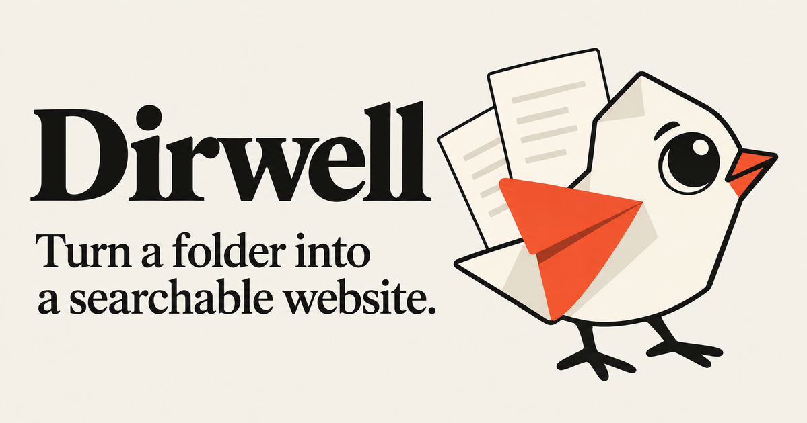
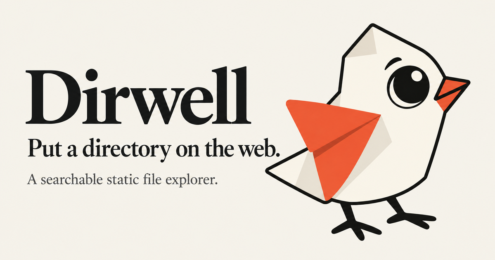
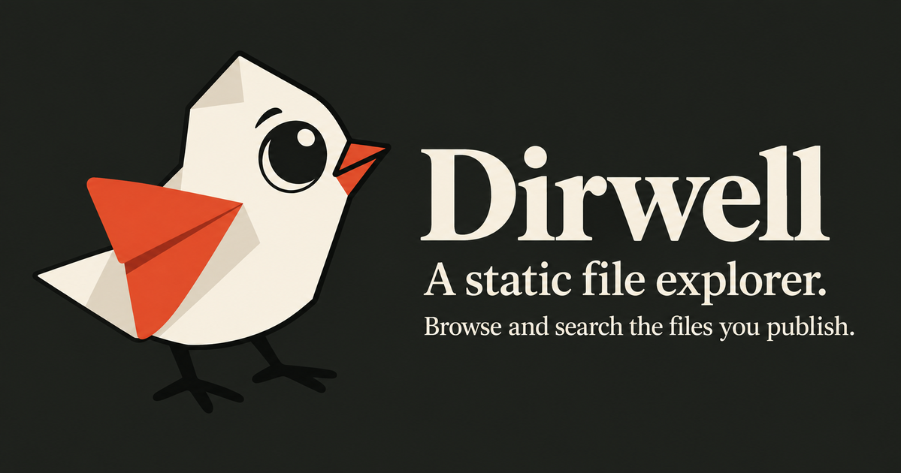

# Dirwell brand artwork

The approved paper bird is the original transparent candidate 3A. The same PNG is used in the README, website hero and header, documentation header, and favicon. Preserve its shape, colors, alpha, and composition; do not redraw or simplify it for the favicon.

## Share images

All three complete images, including illustration, lettering, and composition, were generated in one image-tool call per candidate using the approved bird as the reference. Postprocessing only scales the canvas proportionally and saves it as lossless PNG. There is no cropping, compositing, or typesetting after generation.

The source canvases are 1730 × 909. Proportional scaling into a 1200 × 630 bound produces 1199 × 630; metadata reports the actual dimensions.

### Publishing — selected

The sentence states the input and result directly: “Turn a folder into a searchable website.” The index sheets connect the bird to publishing files.

### Editorial — alternate

### Dark cover — alternate

Exact prompts, the reference, and processing limits are recorded in [provenance.json](./provenance.json). The `*-source.png` files preserve every generated canvas for future proportional exports. Keep shared site metadata in `../site-branding.mjs`; explorer themes retain their own configurable share images.
